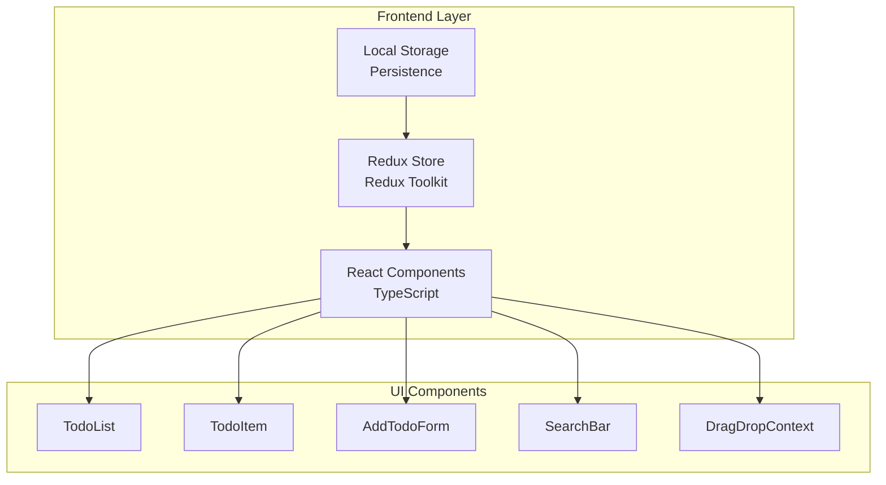

<!-- 
Document Type: TDR
Generated: 2026-01-12T12:26:17.776Z
Tool: Document Architect Agent
-->

---
# Todo App - Technical Design Review

**Status:** Draft | **Author:** Document Architect | **Date:** 2024-12-19  
**Reviewers:** [Engineering Leads]

---

## 1. Executive Summary
This document outlines the technical design for a frontend-only Todo application built with React, TypeScript, and Redux Toolkit. The app supports basic CRUD operations, drag-and-drop reordering, and search functionality with localStorage persistence. It follows modern React patterns and best practices for maintainability and performance.

## 2. Architecture Overview

### 2.1 System Diagram



### 2.2 Component Descriptions
| Component | Technology | Responsibility | Notes |
|-----------|------------|----------------|-------|
| React Components | TypeScript/React | UI rendering and user interactions | Functional components with hooks |
| Redux Store | Redux Toolkit | State management for todos | Centralized state with slices |
| Local Storage | Browser API | Persistent storage | Synchronous operations |
| TodoList | React Component | Display list of todos | Container component |
| TodoItem | React Component | Individual todo display | Edit/delete functionality |
| AddTodoForm | React Component | Input form for new todos | Validation |
| SearchBar | React Component | Filtering todos | Real-time search |
| DragDropContext | react-beautiful-dnd | Drag and drop functionality | Position reordering |

### 2.3 Data Flow
1. User interacts with UI components (AddTodoForm, TodoItem, etc.)
2. Actions are dispatched to Redux store via action creators
3. Redux reducers update state in todos slice
4. Components re-render based on updated state
5. State changes are persisted to localStorage via middleware
6. On app initialization, todos are loaded from localStorage

## 3. Security Design

### 3.1 Input Sanitization Implementation

```typescript
// utils/sanitize.ts
export const sanitizeInput = (input: string): string => {
  // Remove potentially dangerous characters
  return input
    .replace(/</g, "&lt;")
    .replace(/>/g, "&gt;")
    .trim()
    .substring(0, 255); // Prevent excessive input length
};

// components/AddTodoForm.tsx
import { sanitizeInput } from '../utils/sanitize';

const AddTodoForm = () => {
  const [inputValue, setInputValue] = useState('');
  
  const handleSubmit = (e: React.FormEvent) => {
    e.preventDefault();
    if (inputValue.trim()) {
      // Sanitize input before dispatching
      const sanitizedValue = sanitizeInput(inputValue);
      dispatch(addTodo(sanitizedValue));
      setInputValue('');
    }
  };

  return (
    <form onSubmit={handleSubmit}>
      <input
        value={inputValue}
        onChange={(e) => setInputValue(e.target.value)}
        maxLength={255} // Additional client-side constraint
      />
      <button type="submit">Add Todo</button>
    </form>
  );
};
```

**🔒 Junior Dev Note:** Always sanitize user inputs to prevent XSS attacks. Even in simple apps, users can enter `<script>` tags or other malicious content. Also implement both client-side and server-side (if applicable) validation to ensure data integrity.

### 3.2 LocalStorage Security

```typescript
// utils/localStorage.ts
export const safeLocalStorage = {
  setItem: (key: string, value: string): void => {
    try {
      // Check storage quota before setting
      const serializedValue = JSON.stringify(value);
      const storage = JSON.stringify(localStorage);
      const storageSize = new Blob([storage]).size;
      
      if (storageSize > 5 * 1024 * 1024) { // 5MB limit
        console.warn('LocalStorage approaching quota limit');
        // Consider cleanup strategies
        this.cleanupOldTodos();
      }
      
      localStorage.setItem(key, serializedValue);
    } catch (error) {
      console.error('LocalStorage write failed:', error);
      // Fallback to in-memory storage
      window.inMemoryStore = window.inMemoryStore || {};
      window.inMemoryStore[key] = value;
    }
  },

  getItem: (key: string): any => {
    try {
      const item = localStorage.getItem(key);
      return item ? JSON.parse(item) : null;
    } catch (error) {
      console.error('LocalStorage read failed:', error);
      return window.inMemoryStore?.[key] || null;
    }
  },

  removeItem: (key: string): void => {
    try {
      localStorage.removeItem(key);
    } catch (error) {
      console.error('LocalStorage remove failed:', error);
      if (window.inMemoryStore) {
        delete window.inMemoryStore[key];
      }
    }
  }
};
```

### 3.3 Threat Model
| Threat | Likelihood | Impact | Mitigation |
|--------|------------|--------|------------|
| XSS via todo content | Medium | Medium | Input sanitization |
| LocalStorage data exposure | Low | Medium | No sensitive data stored |
| DOM-based XSS in search | Medium | Medium | Proper escaping |
| Excessive localStorage usage | Medium | Low | Quota checking and cleanup |

## 4. Data Design

### 4.1 Data Model

```typescript
// types/todo.ts
export interface Todo {
  id: string; // UUID for uniqueness
  title: string; // Sanitized title
  completed: boolean;
  createdAt: string; // ISO timestamp
  updatedAt: string; // ISO timestamp
  position: number; // For drag-and-drop ordering
}

export interface TodoState {
  todos: Todo[];
  filter: 'all' | 'active' | 'completed';
  searchTerm: string;
}

// Initial state
const initialState: TodoState = {
  todos: [],
  filter: 'all',
  searchTerm: ''
};

// Example localStorage structure
{
  "todos": [
    {
      "id": "uuid-1",
      "title": "Buy groceries",
      "completed": false,
      "createdAt": "2024-12-19T10:00:00.000Z",
      "updatedAt": "2024-12-19T10:00:00.000Z",
      "position": 0
    },
    {
      "id": "uuid-2",
      "title": "Walk the dog",
      "completed": true,
      "createdAt": "2024-12-19T11:00:00.000Z",
      "updatedAt": "2024-12-19T12:00:00.000Z",
      "position": 1
    }
  ],
  "filter": "all",
  "searchTerm": ""
}
```

### 4.2 Redux Toolkit Implementation

```typescript
// store/todosSlice.ts
import { createSlice, PayloadAction } from '@reduxjs/toolkit';
import { Todo, TodoState } from '../types/todo';
import { v4 as uuidv4 } from 'uuid';

const initialState: TodoState = {
  todos: [],
  filter: 'all',
  searchTerm: ''
};

export const todosSlice = createSlice({
  name: 'todos',
  initialState,
  reducers: {
    addTodo: (state, action: PayloadAction<string>) => {
      const newTodo: Todo = {
        id: uuidv4(),
        title: action.payload,
        completed: false,
        createdAt: new Date().toISOString(),
        updatedAt: new Date().toISOString(),
        position: state.todos.length
      };
      state.todos.push(newTodo);
    },
    
    toggleTodo: (state, action: PayloadAction<string>) => {
      const todo = state.todos.find(todo => todo.id === action.payload);
      if (todo) {
        todo.completed = !todo.completed;
        todo.updatedAt = new Date().toISOString();
      }
    },
    
    deleteTodo: (state, action: PayloadAction<string>) => {
      state.todos = state.todos.filter(todo => todo.id !== action.payload);
      // Update positions after deletion
      state.todos.forEach((todo, index) => {
        todo.position = index;
      });
    },
    
    updateTodo: (state, action: PayloadAction<{id: string, title: string}>) => {
      const todo = state.todos.find(todo => todo.id === action.payload.id);
      if (todo) {
        todo.title = action.payload.title;
        todo.updatedAt = new Date().toISOString();
      }
    },
    
    reorderTodos: (state, action: PayloadAction<{sourceIndex: number, destinationIndex: number}>) => {
      const { sourceIndex, destinationIndex } = action.payload;
      const [movedTodo] = state.todos.splice(sourceIndex, 1);
      state.todos.splice(destinationIndex, 0, movedTodo);
      
      // Update positions for all todos
      state.todos.forEach((todo, index) => {
        todo.position = index;
      });
    },
    
    setFilter: (state, action: PayloadAction<'all' | 'active' | 'completed'>) => {
      state.filter = action.payload;
    },
    
    setSearchTerm: (state, action: PayloadAction<string>) => {
      state.searchTerm = action.payload;
    }
  }
});

export const { 
  addTodo, 
  toggleTodo, 
  deleteTodo, 
  updateTodo, 
  reorderTodos, 
  setFilter, 
  setSearchTerm 
} = todosSlice.actions;

export default todosSlice.reducer;
```

**🔒 Junior Dev Note:** Use UUIDs for IDs instead of array indices. Array indices change when items are reordered or deleted, which can cause bugs. UUIDs remain stable regardless of position changes.

## 5. Scalability Design

### 5.1 Virtualization for Large Lists

```typescript
// components/VirtualizedTodoList.tsx
import {FixedSizeList as List} from 'react-window';
import {useAppSelector} from '../store/hooks';
import TodoItem from './TodoItem';

const VirtualizedTodoList = () => {
  const filteredTodos = useAppSelector(selectFilteredTodos);
  
  // Only render visible todos for better performance
  const Row = ({index, style}: {index: number, style: React.CSSProperties}) => (
    <div style={style}>
      <TodoItem todo={filteredTodos[index]} />
    </div>
  );

  return (
    <List
      height={600} // Fixed container height
      itemCount={filteredTodos.length}
      itemSize={50} // Height of each row
      width="100%"
    >
      {Row}
    </List>
  );
};
```

### 5.2 LocalStorage Persistence Middleware

```typescript
// store/persistenceMiddleware.ts
import { Middleware } from '@reduxjs/toolkit';
import { RootState } from './store';
import { safeLocalStorage } from '../utils/localStorage';

export const localStorageMiddleware: Middleware<{}, RootState> = 
  (store) => (next) => (action) => {
    // Process action first
    const result = next(action);
    
    // Only persist specific actions that modify todos
    const actionsToPersist = [
      'todos/addTodo',
      'todos/toggleTodo',
      'todos/deleteTodo',
      'todos/updateTodo',
      'todos/reorderTodos'
    ];
    
    if (actionsToPersist.includes(action.type)) {
      // Debounce persistence to avoid too many writes
      clearTimeout(store.getState()._persistTimer);
      const timer = setTimeout(() => {
        const state = store.getState();
        safeLocalStorage.setItem('todos-state', {
          todos: state.todos.todos,
          filter: state.todos.filter
        });
      }, 1000); // Save after 1 second of inactivity
      
      // Store timer ID in state for cleanup
      store.dispatch({type: '_persistTimer', payload: timer});
    }
    
    return result;
  };

// Preload state from localStorage
export const loadState = () => {
  try {
    const serializedState = safeLocalStorage.getItem('todos-state');
    if (serializedState === null) {
      return undefined;
    }
    return {
      todos: {
        ...serializedState,
        searchTerm: '' // Don't persist search term
      }
    };
  } catch (err) {
    return undefined;
  }
};
```

### 5.3 Performance Monitoring

```typescript
// utils/performance.ts
export const measurePerformance = <T>(fn: () => T, label: string): T => {
  if (process.env.NODE_ENV === 'development') {
    const start = performance.now();
    const result = fn();
    const end = performance.now();
    console.log(`${label} took ${end - start} milliseconds`);
    return result;
  }
  return fn();
};

// Usage in component
const handleReorder = (sourceIndex: number, destinationIndex: number) => {
  measurePerformance(() => {
    dispatch(reorderTodos({sourceIndex, destinationIndex}));
  }, 'Reorder Todos');
};
```

### 5.4 Monitoring & SLIs

| SLI | Target | Measurement |
|-----|--------|-------------|
| Bundle Size | < 200KB | Build output |
| First Load Time | < 2 seconds | Lighthouse audit |
| Todo Operations | < 16ms | Performance.mark API |
| Memory Usage | < 50MB | Chrome DevTools |

## 6. Implementation Guide

### 6.1 Step-by-Step Implementation

1. **Setup Project Structure**
   - Initialize React app with TypeScript
   - Install dependencies (Redux Toolkit, react-beautiful-dnd, uuid)
   - Configure ESLint with TypeScript and React rules
   - Set up folder structure (components, store, types, utils)

2. **Implement Redux Store**
   - Create todos slice with CRUD operations
   - Add selectors for filtered/searched todos
   - Implement localStorage persistence middleware
   - Set up store configuration with preloaded state

3. **Build Core Components**
   - TodoItem component with edit/delete functionality
   - AddTodoForm with validation and sanitization
   - TodoList with filtering capabilities
   - SearchBar component

4. **Add Drag-and-Drop**
   - Implement react-beautiful-dnd context
   - Connect drag events to Redux actions
   - Handle position updates correctly

5. **Testing and Optimization**
   - Unit tests for Redux reducers
   - Integration tests for components
   - Performance optimization with memoization
   - Accessibility improvements

### 6.2 Common Pitfalls & How to Avoid Them

⚠️ **Pitfall 1: Direct State Mutation**
```typescript
// ❌ WRONG: Direct mutation breaks Redux immutability
const toggleTodoWrong = (state, action) => {
  const todo = state.todos.find(t => t.id === action.payload);
  todo.completed = !todo.completed; // Direct mutation!
};

// ✅ RIGHT: Immutability maintained
const toggleTodoRight = (state, action) => {
  const todo = state.todos.find(t => t.id === action.payload);
  if (todo) {
    // Create new object with spread operator
    Object.assign(todo, { 
      completed: !todo.completed,
      updatedAt: new Date().toISOString()
    });
  }
};
```

⚠️ **Pitfall 2: Not Handling Undefined States**
```typescript
// ❌ WRONG: Assumes localStorage always has data
const todos = JSON.parse(localStorage.getItem('todos'));

// ✅ RIGHT: Handle null/undefined cases
const loadTodos = (): Todo[] => {
  const stored = localStorage.getItem('todos');
  if (!stored) return [];
  
  try {
    return JSON.parse(stored);
  } catch (error) {
    console.error('Failed to parse todos from localStorage');
    return [];
  }
};
```

⚠️ **Pitfall 3: Performance Issues with Large Lists**
```typescript
// ❌ WRONG: Rendering all todos at once
{todos.map(todo => <TodoItem key={todo.id} todo={todo} />)}

// ✅ RIGHT: Virtualize long lists
<List
  height={600}
  itemCount={todos.length}
  itemSize={50}
>
  {({index, style}) => (
    <div style={style}>
      <TodoItem todo={todos[index]} />
    </div>
  )}
</List>
```

⚠️ **Pitfall 4: Incorrect Drag-and-Drop Implementation**
```typescript
// ❌ WRONG: Not updating positions properly
const handleDragEnd = (result) => {
  // Just reordering array without updating position properties
  const newTodos = Array.from(todos);
  const [moved] = newTodos.splice(result.source.index, 1);
  newTodos.splice(result.destination.index, 0, moved);
  setTodos(newTodos);
};

// ✅ RIGHT: Update position properties
const handleDragEnd = (result) => {
  if (!result.destination) return;
  
  dispatch(reorderTodos({
    sourceIndex: result.source.index,
    destinationIndex: result.destination.index
  }));
};
```

## 7. Testing Strategy

```typescript
// tests/todosSlice.test.ts
import todosReducer, { addTodo, toggleTodo, deleteTodo } from '../store/todosSlice';
import { TodoState } from '../types/todo';

describe('todosSlice', () => {
  const initialState: TodoState = {
    todos: [],
    filter: 'all',
    searchTerm: ''
  };

  it('should add a todo', () => {
    const actual = todosReducer(initialState, addTodo('Test todo'));
    
    expect(actual.todos).toHaveLength(1);
    expect(actual.todos[0].title).toEqual('Test todo');
    expect(actual.todos[0].completed).toBe(false);
  });

  it('should toggle a todo', () => {
    const stateWithTodo = {
      ...initialState,
      todos: [{
        id: '1',
        title: 'Test',
        completed: false,
        createdAt: '',
        updatedAt: '',
        position: 0
      }]
    };
    
    const actual = todosReducer(stateWithTodo, toggleTodo('1'));
    expect(actual.todos[0].completed).toBe(true);
  });

  it('should delete a todo', () => {
    const stateWithTodo = {
      ...initialState,
      todos: [{
        id: '1',
        title: 'Test',
        completed: false,
        createdAt: '',
        updatedAt: '',
        position: 0
      }]
    };
    
    const actual = todosReducer(stateWithTodo, deleteTodo('1'));
    expect(actual.todos).toHaveLength(0);
  });
});

// tests/components/TodoItem.test.tsx
import { render, screen, fireEvent } from '@testing-library/react';
import TodoItem from '../components/TodoItem';
import { Provider } from 'react-redux';
import { store } from '../store/store';

describe('TodoItem', () => {
  const mockTodo = {
    id: '1',
    title: 'Test Todo',
    completed: false,
    createdAt: '2024-01-01T00:00:00.000Z',
    updatedAt: '2024-01-01T00:00:00.000Z',
    position: 0
  };

  it('renders todo title correctly', () => {
    render(
      <Provider store={store}>
        <TodoItem todo={mockTodo} />
      </Provider>
    );
    
    expect(screen.getByText('Test Todo')).toBeInTheDocument();
  });

  it('toggles completion when checkbox is clicked', () => {
    render(
      <Provider store={store}>
        <TodoItem todo={mockTodo} />
      </Provider>
    );
    
    const checkbox = screen.getByRole('checkbox');
    fireEvent.click(checkbox);
    
    // Verify action was dispatched (would require mocking useDispatch)
    expect(checkbox).toBeChecked();
  });
});
```

## 8. Open Questions & Decisions

- [ ] **Decision needed:** Use UUID library or custom ID generation?
- [ ] **Decision needed:** Implement undo/redo functionality?
- [ ] **Decision needed:** Add due dates or categories to todos?
- [ ] **Follow-up:** Need to implement keyboard navigation for accessibility
- [ ] **Follow-up:** Need to add dark mode support

---
*Generated by Document Architect - Principal Engineer Mode*
---